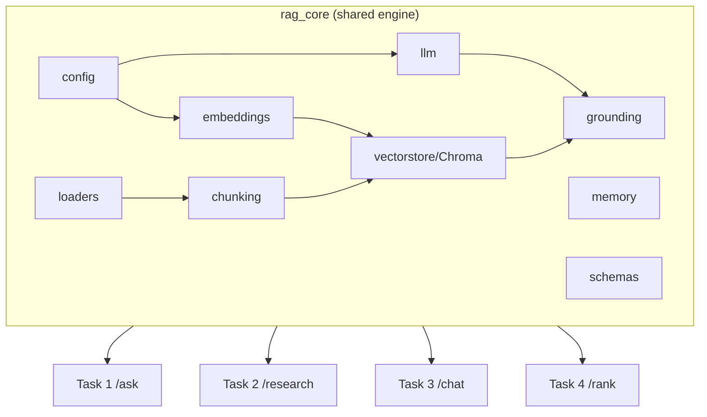

# 00 — System Architecture (HLD) & Shared Core (LLD)

Infinite GenAI Engineer Assessment — four deliverables, one engine.

## 1. Why a shared core

The four tasks are graded independently, but ~70% of their machinery is identical:
load documents → chunk → embed → store → retrieve → **ground** the LLM → **remember**
the conversation. Building that four times is the wrong signal. Instead we build one
`rag_core` package and compose it into four thin FastAPI apps. Each app still ships its
own `README`, `Dockerfile`, `.env.example`, and sample data, so any single task can be
reviewed and run in isolation (`cd taskN && docker compose up`).



## 2. Runtime decisions

| Decision | Choice | Rationale |
|----------|--------|-----------|
| Language / API | Python 3.11 + FastAPI | Async, auto OpenAPI docs at `/docs`, Pydantic validation |
| LLM | OpenAI `gpt-4o-mini` | Cheap, fast, strong enough; swappable via `.env` |
| Embeddings | OpenAI `text-embedding-3-small` | 1536-dim, cheap; local `sentence-transformers` fallback toggle |
| Vector store | **Chroma** (persistent) | Brief allows FAISS/Chroma; Chroma has simpler API, no index-file juggling |
| Packaging | Docker (`python:3.11-slim`) | Kills wheel/version friction (host is Py 3.14), earns Docker bonus, 1-command handoff |
| Config | `pydantic-settings` | 12-factor, `.env`-driven, typed |

## 3. Shared core — module contracts (LLD)

Each module has one purpose and a small, testable surface.

### `config.py`
`Settings(BaseSettings)` reads env: `OPENAI_API_KEY`, `LLM_MODEL`, `EMBED_MODEL`,
`CHUNK_SIZE`, `CHUNK_OVERLAP`, `TOP_K`, `SCORE_THRESHOLD`, `EMBED_BACKEND`
(`openai|local`), `CHROMA_DIR`. Exposes a cached `get_settings()`.

### `schemas.py` (shared Pydantic models)
- `Source{ id, text, metadata: dict, score: float }`
- `Answer{ answer: str, sources: list[Source], grounded: bool, latency_ms: float }`
- `ChatTurn{ role, content }`

### `loaders.py`
`load_documents(path) -> list[RawDoc]` — walks a dir, reads `.pdf` (pypdf), `.txt`,
`.md`. Returns `{text, metadata:{source, page}}`. Skips unreadable files with a logged
warning (error-handling rubric).

### `chunking.py`
`chunk_documents(docs, size, overlap) -> list[Chunk]` — recursive character splitter
(split on `\n\n`, `\n`, `. `, ` `). Preserves source metadata + a stable `chunk_id`.

### `embeddings.py`
`Embedder` with `embed(texts) -> list[vector]`. `OpenAIEmbedder` (batched, retry with
backoff) and `LocalEmbedder` (sentence-transformers `all-MiniLM-L6-v2`). Chosen by
`EMBED_BACKEND`.

### `vectorstore.py`
`VectorStore` wraps a persistent Chroma collection.
- `add(chunks, embeddings)` — idempotent upsert by `chunk_id`
- `search(query_vec, k) -> list[Source]` — returns cosine similarity in `[0,1]`
- `count()`, `reset()`

### `llm.py`
`LLMClient` wraps OpenAI chat.
- `complete(messages, **kw) -> str`
- `complete_json(messages, schema) -> dict` — forces structured output (used by Task 4)
- `stream(messages)` — token generator (Task 2 bonus)
- Retries transient errors; raises typed `LLMError` on hard failure.

### `grounding.py` — the rubric-critical module
`answer_from_context(query, sources, llm, threshold) -> Answer`:
1. If `sources` empty **or** best `score < threshold` → return the exact string
   *"I don't have enough information to answer that based on the provided documents."*
   with `grounded=False`. (Cheap guard before spending a token.)
2. Else build a strict system prompt: *answer ONLY from the numbered context; if the
   answer isn't present, say the insufficient-info line; cite sources as [1],[2]*.
3. Post-check: if the model emitted the insufficient-info line, mark `grounded=False`.
4. Attach `sources` used + `latency_ms`.

This one module satisfies **Grounding / hallucination-prevention** for Tasks 1 & 3.

### `memory.py`
`ConversationStore` interface: `append(session_id, turn)`, `history(session_id, n)`.
`InMemoryStore` (default, dict) and `RedisStore` (Task 3 bonus). Windowed to last N turns.

## 4. Cross-cutting concerns

- **Error handling:** every app wraps handlers so missing API key, empty corpus, bad
  input, and upstream LLM errors return structured HTTP 4xx/5xx with a `detail` message —
  never a stack trace. `rag_core` raises typed exceptions; apps translate them.
- **Config safety:** app refuses to start if `OPENAI_API_KEY` unset (clear message).
- **Ingestion is idempotent:** re-running ingest doesn't duplicate vectors.
- **Latency:** `answer_from_context` stamps `latency_ms`; exposed in responses (Task 1 bonus).
- **Testing:** `rag_core` unit-tested with a `FakeLLM`/`FakeEmbedder` so tests need no
  network/key. Each app has a smoke test hitting its endpoint with the fakes injected.

## 5. Repository layout

```
infinite-genai-assessments/
├── rag_core/            # shared engine (installed editable into each app)
├── task1_clinical_rag/  # POST /ask
├── task2_research_agents/  # POST /research
├── task3_support_copilot/  # POST /chat
├── task4_resume_ranker/    # POST /rank
├── docs/                # these design docs
├── docker-compose.yml   # bring up all four
└── README.md
```

## 6. Build order

`rag_core` → Task 1 → Task 3 (Task 1 + escalation) → Task 4 → Task 2 (most independent).
