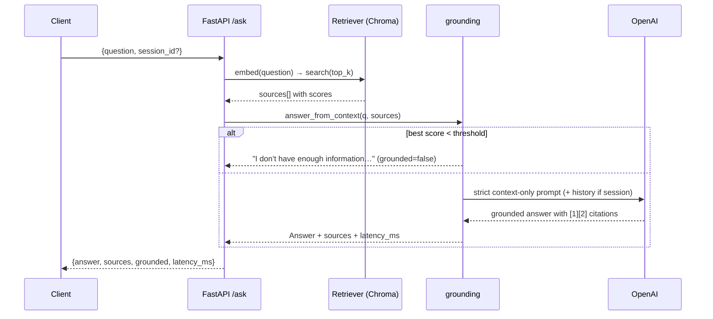

# 01 — Task 1: RAG Clinical Knowledge Assistant

Answer questions from a medical document corpus, grounded only in retrieved context.

## Rubric → design map

| Criterion | Weight | How the design satisfies it |
|-----------|--------|------------------------------|
| Working RAG | 30% | `rag_core` ingest → Chroma → retrieve → `answer_from_context` |
| API | 20% | `POST /ask`, `POST /ingest`, `GET /health`, auto OpenAPI at `/docs` |
| Grounding | 20% | `grounding.py` threshold guard + strict prompt + refusal string |
| Code quality | 15% | shared core, typed schemas, small modules, tests |
| README | 10% | run steps, arch, 5 eval questions, curl examples |
| Error handling | 5% | typed errors → structured HTTP; empty-corpus + bad-input guards |
| **Bonus** | — | conversation memory, citation highlighting, Docker, Streamlit, latency |

## HLD

## LLD

**Ingestion** — `python -m app.ingest` (or `POST /ingest`): load `data/*.pdf|txt` →
chunk (size 800 / overlap 120) → embed → upsert to Chroma at `CHROMA_DIR`. Idempotent.

**Endpoints**
- `POST /ask` → body `AskRequest{ question: str, session_id: str|None, top_k: int=4 }`
  → `Answer{ answer, sources[], grounded, latency_ms }`.
- `POST /ingest` → re-index the corpus; returns `{chunks_indexed}`.
- `GET /health` → `{status, doc_count}`.

**Grounding config:** `SCORE_THRESHOLD=0.35`, `TOP_K=4`. Tunable per corpus.

**Conversation memory (bonus):** if `session_id` provided, last 4 turns prepended to the
prompt via `InMemoryStore`. Stateless if omitted.

**Citation highlighting (bonus):** each `Source` carries the exact chunk `text`; the
Streamlit UI renders answer + expandable cited snippets with the matched sentence marked.

**Latency (bonus):** `latency_ms` measured around retrieval+generation, returned + shown.

**Sample corpus:** 6 synthetic clinical docs (hypertension, T2 diabetes, asthma,
anticoagulation, sepsis, post-op care) so the demo runs with zero external data.

**5 evaluation questions** (shipped in README, answerable from the corpus + one designed
to trigger refusal): e.g. "First-line agent for stage-1 hypertension?", "Target INR on
warfarin for AFib?", and one out-of-scope ("What's the capital of France?") to prove
grounding refuses.

**UI (bonus):** `streamlit_app.py` — ask box, answer, cited snippets, latency badge.

## Testing
- `test_grounding.py`: below-threshold → refusal; good context → cites sources (FakeLLM).
- `test_api.py`: `/ask` happy path + empty-question 422 + refusal path.
