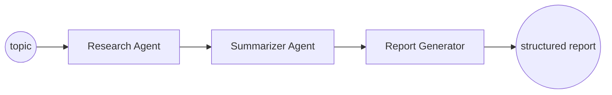

# 02 — Task 2: Multi-Agent Research Assistant

Research a topic and generate a structured report via three cooperating agents.

## Rubric → design map

| Criterion | How the design satisfies it |
|-----------|------------------------------|
| Agent orchestration | LangGraph state machine: Research → Summarize → Report |
| Prompts | One focused system prompt per agent, versioned in `prompts.py` |
| Modular architecture | Each agent is a pure `(state) -> state` node; graph wires them |
| Error handling | Per-node try/except → error captured in state, graceful partial report |
| Clean code | Typed `ResearchState`, small nodes, no cross-agent coupling |
| **Bonus** | LangGraph (used), streaming, async execution, agent memory |

## HLD

Shared `ResearchState` flows through the graph; each node reads what it needs and writes
its output. No node calls another directly — orchestration lives only in the graph.

## LLD

**State** (`ResearchState`, TypedDict):
`topic, findings: list[Finding], summary: str, report: Report, errors: list[str]`.

**Agents** (nodes)
1. **Research Agent** — expands the topic into 3–5 sub-questions, then for each produces
   grounded findings. Two modes via `RESEARCH_SOURCE` env:
   - `corpus` (default, offline-safe): retrieves from a small Chroma corpus of seed docs
     using `rag_core`. Deterministic, no external calls, always demoable.
   - `web`: optional Tavily/DuckDuckGo search if a key is present. Falls back to `corpus`.
2. **Summarizer Agent** — condenses findings into a coherent narrative, deduping and
   ranking by relevance.
3. **Report Generator** — emits a structured `Report{ executive_summary, key_findings[],
   risks[], recommendations[] }` via `llm.complete_json` (schema-enforced).

**API**
- `POST /research` → `{ topic: str, mode?: "corpus"|"web" }` → `Report` JSON.
- `POST /research/stream` (bonus) → Server-Sent Events streaming each agent's progress
  (`event: research_done`, `summary_done`, `report_token`).
- `GET /health`.

**Async (bonus):** research sub-questions fetched concurrently with `asyncio.gather`.

**Agent memory (bonus):** optional `session_id` keeps prior topics/reports so follow-up
research can reference earlier findings (`InMemoryStore`).

**Error handling:** each node wrapped; on failure it appends to `state.errors` and passes
through so the report still generates from whatever succeeded (never a 500 from one bad
sub-query). Total failure (e.g. no API key) → clean 503.

**Prompts** live in `prompts.py`, each a named constant with a short rationale comment.

**Sample corpus:** a handful of seed docs on a demo topic (e.g. "LLM agents in
production") so `corpus` mode returns real findings offline.

## Testing
- `test_agents.py`: each node with FakeLLM produces well-formed state.
- `test_graph.py`: end-to-end graph on a topic yields a complete `Report` with all four
  sections; a forced node error still yields a report + recorded error.
