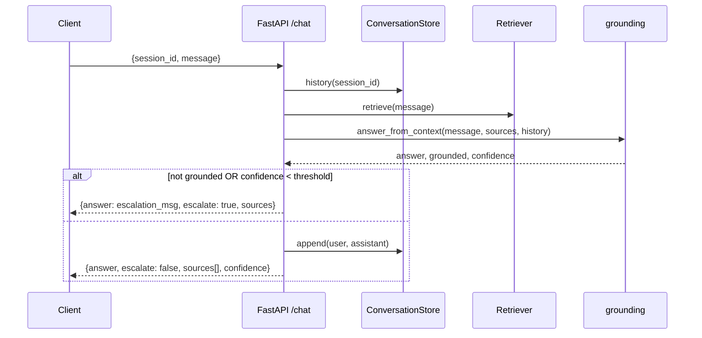

# 03 — Task 3: AI Customer Support Copilot

Answer from internal FAQ docs, keep conversation history, escalate low-confidence queries.

## Rubric → design map

| Criterion | How the design satisfies it |
|-----------|------------------------------|
| Memory | `ConversationStore` keyed by `session_id`, windowed; Redis backend (bonus) |
| Retrieval quality | `rag_core` retrieval over FAQ corpus, scored |
| Hallucination prevention | shared `grounding.py` — context-only + refusal string |
| API design | `POST /chat {session_id, message}` → answer + citations + escalation flag |
| **Bonus** | Redis conversation memory, source citations, highlighted evidence |

Task 3 = Task 1's RAG + grounding, **plus** durable per-session memory and an escalation
decision. It deliberately reuses `rag_core` wholesale.

## HLD

## LLD

**Endpoint**
`POST /chat` → `ChatRequest{ session_id: str, message: str }` →
`ChatResponse{ answer, escalate: bool, confidence: float, sources: list[Source],
session_id }`.

Supporting: `GET /session/{id}` (history for debugging), `POST /ingest`, `GET /health`.

**Confidence & escalation:** confidence = best retrieval score. Escalate when
`grounded == False` **or** `confidence < ESCALATE_THRESHOLD` (default 0.30). Escalation
response returns a polite hand-off message
(*"I'm not fully confident — routing you to a human agent."*) and sets `escalate=true`.
Escalated turns are still logged to history.

**Memory:** last `MEMORY_WINDOW=6` turns injected into the prompt. Backend selected by
`MEMORY_BACKEND=memory|redis`; `RedisStore` uses a list per `session_id` with TTL. If
Redis configured but unreachable → log + fall back to in-memory (no request failure).

**Citations / highlighted evidence (bonus):** response includes cited `sources` with the
exact snippet; the Streamlit chat UI shows the answer with an "evidence" expander that
highlights the sentence the answer drew from.

**Sample corpus:** synthetic SaaS product FAQ (billing, password reset, plans, refunds,
API limits, data export) so the copilot answers real product questions offline. Includes
one query with no FAQ coverage to demonstrate escalation.

## Testing
- `test_escalation.py`: low score → `escalate=True` + hand-off message.
- `test_memory.py`: multi-turn session retains context (follow-up "and for the annual
  plan?" resolves against prior turn).
- `test_api.py`: `/chat` happy path + missing `session_id` 422.
