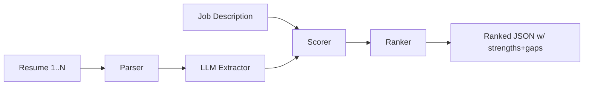

# 04 — Task 4: AI Resume Screening & Candidate Ranking

Rank resumes against a job description; return ranked candidates with strengths and gaps.

## Rubric → design map

| Criterion | Weight | How the design satisfies it |
|-----------|--------|------------------------------|
| Resume parsing | 20% | `parser.py` reads PDF/txt → normalized text → structured extraction |
| LLM reasoning | 20% | LLM extracts skills/edu/exp/certs + judges fit vs JD with rationale |
| Ranking quality | 25% | Hybrid score: embedding similarity + LLM rubric score, weighted |
| Architecture | 15% | parse → extract → score → rank pipeline, each stage isolated |
| Prompting | 10% | schema-locked extraction + scoring prompts in `prompts.py` |
| Documentation | 10% | README with schema, curl, scoring formula |
| **Bonus** | — | hybrid scoring, embeddings, structured JSON output |

## HLD



## LLD

**Pipeline stages** (each pure, independently testable):
1. **Parser** (`parser.py`) — PDF (pypdf) / txt → clean text. Handles multi-column-ish
   text and empty/garbled files (skipped with reason).
2. **Extractor** (`extractor.py`) — `llm.complete_json` → `CandidateProfile{ name,
   skills[], education[], experience[]{title, org, years}, certifications[],
   total_years }`. Schema-enforced so output is always valid JSON.
3. **Scorer** (`scorer.py`) — **hybrid** (bonus):
   - `semantic` = cosine(embed(resume_text), embed(JD)) → normalized 0–1
   - `rubric` = LLM scores fit 0–100 across required-skill coverage, seniority match,
     domain relevance, with a one-line justification
   - `score = round(0.4*semantic*100 + 0.6*rubric, 1)` (weights configurable)
4. **Ranker** — sort desc; produce per-candidate `strengths[]` (JD requirements met) and
   `gaps[]` (JD requirements missing), derived from extracted skills ∩/∖ JD requirements.

**API**
`POST /rank` — two input modes:
- JSON: `{ job_description: str, resumes: [{id, text}] }`
- multipart: `job_description` + uploaded resume files.

Response:
```json
{ "job_description_summary": "...",
  "ranked": [
    { "id": "c1", "name": "...", "score": 87.4,
      "semantic_score": 0.71, "rubric_score": 92,
      "strengths": ["Python", "AWS", "5y backend"],
      "gaps": ["No Kubernetes", "No leadership exp"],
      "justification": "Strong backend + cloud match; lacks k8s." } ] }
```

Supporting: `GET /health`.

**Structured JSON (bonus):** every LLM call is schema-locked via `complete_json`; the
whole response is a typed Pydantic model — no free-text parsing.

**Determinism:** `temperature=0` for extraction and scoring so re-runs rank consistently.

**Sample data:** one JD (Senior Backend Engineer) + 4 synthetic resumes spanning strong /
partial / weak fit so ranking order is visibly correct.

## Error handling
- Unparseable resume → excluded from ranking with a `skipped[]` entry + reason (not a 500).
- Empty `resumes` or missing `job_description` → 422.
- LLM/JSON failure on one candidate → that candidate scored 0 with an error note; others
  still rank.

## Testing
- `test_extractor.py`: FakeLLM returns profile; schema validates.
- `test_scorer.py`: strong-fit resume outranks weak-fit; strengths/gaps computed correctly.
- `test_api.py`: `/rank` returns sorted list; empty input 422.
